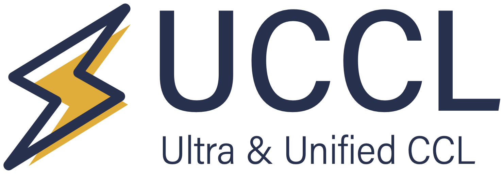
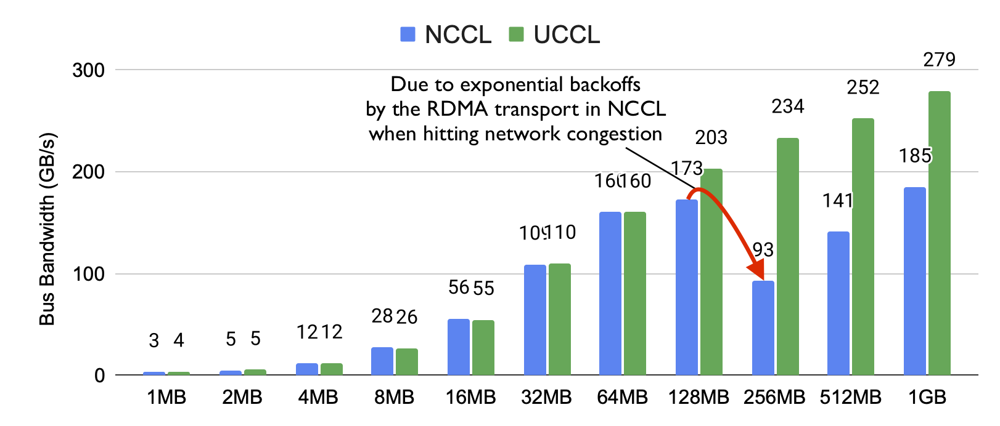
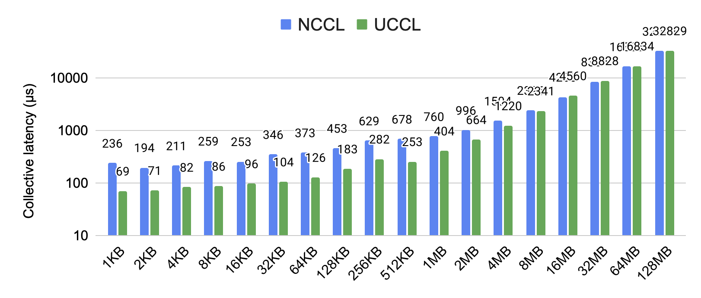
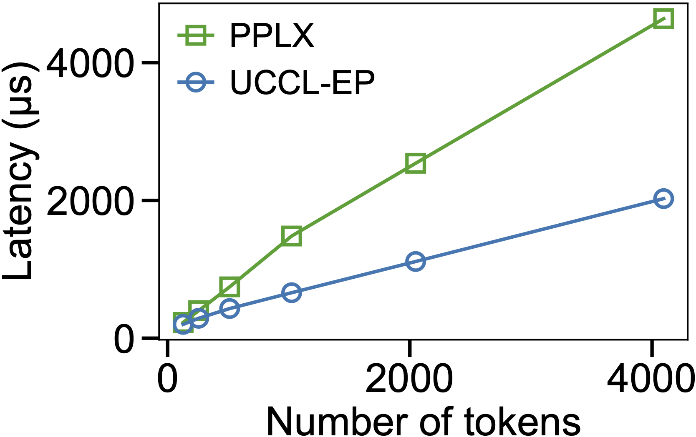
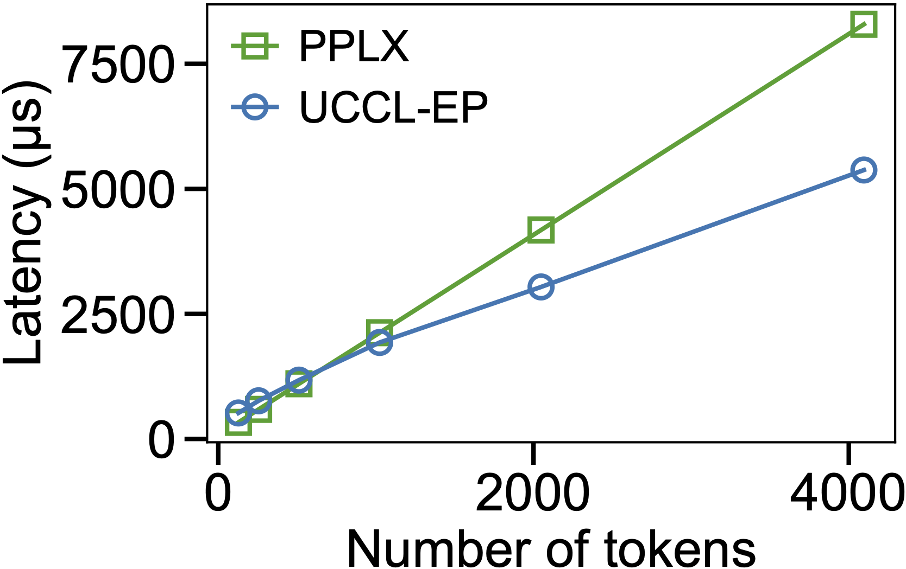

<div align="center">

<p align="center">  </p>

[](https://uccl-project.github.io/) [](https://github.com/uccl-project/uccl) [](https://x.com/uccl_proj)
<p align="center">
    <a href="#about"><b>About</b></a> | 
    <a href="#road-map"><b>Road Map</b></a> | 
    <a href="#quick-start"><b>Quick Start</b></a> | 
    <a href="#dev-guide"><b>Dev Guide</b></a> | 
    <a href="#acknowledgement"><b>Acknowledgement</b></a> |
    <a href="#contact"><b>Contact</b></a>
</p>

</div>

## About 

UCCL is an efficient communication library for GPUs, covering collectives, P2P (e.g., KV cache transfer, RL weight transfer), and EP (e.g., IBGDA), with two key focuses: 
* **Flexibility** for high performance in fast-evolving ML workloads
* **Portability** for connecting heterogeneous GPUs in ML workloads

An UCCL overview can be found in this [slide deck](https://docs.google.com/presentation/d/1LQxZzxghRmua4FkfQjWu69wXy9hrs9V_tXrXt_DT-F4/edit?usp=sharing) with the following components: 

* **[UCCL-collective](collective/)** serves as a drop-in replacement for NCCL/RCCL (e.g., requiring no changes to application code), and significantly outperforms them in both latency and throughput across various settings. 

  <details>
  <summary>UCCL-collective performance comparison</summary>

  * On six HGX servers (across two racks) with 8x400G CX-7 RoCE NICs and 8xH100 GPUs, UCCL-collective outperforms NCCL by up to **2.5x** for AllReduce:
    <p align="left">  </p>
  * On two AWS `g4dn.8xlarge` instances with 1x50G ENA NICs and 1xT4 GPUs within the same cluster placement group, UCCL-collective outperforms NCCL by up to **3.7x** for AllReduce: 
    <p align="left">  </p>
  </details>

  <details>
  <summary>UCCL-collective high-level design</summary>

  * UCCL-collective aims to: 
    * rearchitect the CCL layer (while keeping NCCL APIs) to unleash the full potential of network hardware
    * rearchitect the network transport layer to be fast and extensible
    * support heterogeneous GPU and networking vendors such as Nvidia, AMD, and Broadcom
    * become an open and collaborative platform for GPU communication research
  * UCCL-collective has built a fast and extensible transport layer in software, which has created many benefits. 
    * For example, existing network transports under NCCL (i.e., kernel TCP and RDMA) leverage one or few network paths to stream huge data volumes, thus prone to congestion happening in datacenter networks. 
    * Instead, UCCL-collective employs packet spraying in software to leverage abundant network paths to avoid "single-path-of-congestion". 
    * More benefits include: 1) packet spraying with 256 paths, 2) advanced congestion control such as latency-based and receiver-driven ones, 3) efficient loss recovery by selective repeat, and 4) widely usable in public clouds with legacy NICs and Ethernet. Feel free to check out our full [technical report](https://arxiv.org/pdf/2504.17307).
  </details>

* **[UCCL-P2P](p2p/)** provides both NIXL-style initiator-target tranfer APIs and NCCL-style collective APIs, with the same or better performance than both. UCCL-P2P is purposely designed for the next-gen 800Gbps NICs with efficient multi-threaded transfer engines. 

  <details>
  <summary>UCCL-P2P performance comparison</summary>

  * Message transfer bandwidth over RDMA on AMD MI300X + Broadcom Thor-2:
    <p align="left">  </p>
  </details>

* **[UCCL-EP](ep/)** allows running DeepEP atop of heterogeneous hardware platforms, including AMD and Nvidia GPUs, and any RDMA NICs such as AWS EFA NICs and Broadcom NICs, while achieving IBGDA-level performance. 

  <details>
  <summary>UCCL-EP performance comparison</summary>

  * EP32 dispatch and combine on AWS p5en (8x H200 + 16x 200Gb/s EFA):
    <p align="left">
      
      
    </p>
  </details>

UCCL has been adopted as part of the AMD [TheRock](https://github.com/ROCm/TheRock) ecosystem.

## Road Map

More UCCL features are under development in this repo, currently including: 
- ✅ More efficient KV cache transfer engine (e.g., better Mooncake)
  - ✅ Supporting AMD GPUs
  - 🚧 Supporting RDMA (NVIDIA, Broadcom), AWS EFA, GCP TCPX, TCP
- ✅ Efficient and portable expert-parallel communication
  - ✅ Supporting all NIC vendors, including Nvidia, AWS EFA, and Broadcom
  - ✅ Supporting AMD GPUs
  - 🚧 Better flow control to avoid congestion
  - ☐ Supporting other AI accelerators, such as TPUs and Trainium.
- 🚧 Re-architecting NCCL to unleash network hardware performance
  - 🚧 Scalable and efficient CPU proxy
  - ☐ Fast async collectives with compute-communication ordering guarantee
  - ☐ Device kernels in vendor-agnostic Triton language
- ☐ Dynamic membership with GPU servers joining and exiting

## Quick Start

The easiest way to use UCCL is to first build based on your platform. The build script will automatically detect the `py_version` of your current environment. If you need to compile UCCL for a specific python version, please specify the `py_version`, such as `3.10`. 

```bash
git clone https://github.com/uccl-project/uccl.git --recursive && cd uccl

# For collective and p2p: eg, bash build.sh cuda ccl_rdma --install
bash build.sh [cuda|rocm|therock] [all|ccl_rdma|ccl_efa|p2p] [py_version] [rocm_index_url] --install

# For ep: 
cd ep && bash build.sh [cuda|rocm] [py_version] --install
```
> Note: 
> - when building for ROCm with python packaging through TheRock, please specify your ROCm index url; the default is `https://rocm.prereleases.amd.com/whl/gfx94X-dcgpu` and it may not be what you want. When installing UCCL wheels for TheRock, please provide pip with the index url and add the optional extra `[rocm]` to the wheel, e.g., `pip install --extra-index-url https://rocm.prereleases.amd.com/whl/gfx94X-dcgpu wheelhouse-therock/uccl-0.0.1.post4-py3-none-manylinux_2_27_x86_64.manylinux_2_28_x86_64.whl[rocm]`.
> - you can build with different CUDA or ROCm versions by specifying tags such as cuda13 or rocm6. The default versions are CUDA 12.x for the "cuda" tag and ROCm 7.x for the "rocm" tag.
> - check [docs/wheel_build.md](./docs/wheel_build.md) for details.

Then, when running your PyTorch applications, set the environment variable accordingly: 
```bash
# NCCL over IB/RoCE on x86 or GH200 ARM hosts
NCCL_NET_PLUGIN=`python -c "import uccl; print(uccl.nccl_plugin_path())"`

# RCCL over IB/RoCE on x86 hosts
NCCL_NET_PLUGIN=`python -c "import uccl; print(uccl.rccl_plugin_path())"`

# NCCL over AWS EFA NICs (p4d and p4de only)
LD_PRELOAD=`python -c "import uccl; print(uccl.efa_nccl_path())"`
NCCL_NET_PLUGIN=`python -c "import uccl; print(uccl.efa_plugin_path())"`
```

Now, you can just run your PyTorch applications and enjoy UCCL performance benefits! 

## Dev Guide

<details>
<summary>Click</summary>

First clone the UCCL repo and init submodules: 
```bash
git clone https://github.com/uccl-project/uccl.git --recursive
export UCCL_HOME=$(pwd)/uccl
```

To build UCCL for development, you need to install some common dependencies: 
```bash
# Note if you are using docker+wheel build, there is no need to install the following dependencies. 
sudo apt update
sudo apt install linux-tools-$(uname -r) clang llvm cmake m4 build-essential \
                 net-tools libgoogle-glog-dev libgtest-dev libgflags-dev \
                 libelf-dev libpcap-dev libc6-dev-i386 libpci-dev \
                 libopenmpi-dev libibverbs-dev clang-format -y

# Install and activate Miniconda (you can choose any recent versions)
wget https://repo.anaconda.com/miniconda/Miniconda3-latest-Linux-x86_64.sh
bash ./Miniconda3-latest-Linux-x86_64.sh -b
source ~/miniconda3/bin/activate
source ~/.bashrc # or .zshrc and others
conda init

# Install python ssh lib
pip install paramiko pybind11
# Upgrade conda glic to modern ones
conda install -c conda-forge "libstdcxx-ng>=12" "libgcc-ng>=12"
```

For quick installation with docker, you can directly dive into: 
* [`UCCL-Collective RDMA`](collective/rdma/README.md): Collectives for Nvidia/AMD GPUs + IB/RoCE RDMA NICs (currently support Nvidia and Broadcom NICs)
* [`UCCL-Collective EFA`](collective/efa/README.md): Collectives for AWS EFA NIC (currently support p4d.24xlarge)

    > On p5/p5e/p5en/p6, the offical [aws-ofi-nccl](https://github.com/aws/aws-ofi-nccl) NCCL plugin with proper [env variables](https://github.com/uccl-project/uccl/blob/deeeaa36ebe5440449273633652d2b7d77f4a7aa/collective/efa/run_nccl_test.sh#L76-L77) already makes NCCL perform excellent
* [`UCCL-Collective AFXDP`](collective/afxdp/README.md): Collectives for Non-RDMA NICs (currently support AWS ENA NICs and IBM VirtIO NICs)
* [`UCCL-P2P`](p2p/README.md): P2P for RDMA NICs and GPU IPCs (currently support Nvidia/AMD GPUs and Nvidia/Broadcom NICs)
* [`UCCL-EP`](ep/README.md): EP for MoE training and inference with DeepEP-compatible APIs (currently support Nvidia/AMD GPUs and Nvidia/Broadcom/EFA NICs)

</details>

## Citation
The code in this repository is mostly described in the papers below. Please consider citing this work if you find the repository helpful. 

```bibtex
@article{uccl_transport,
  title={An Extensible Software Transport Layer for GPU Networking},
  author={Zhou, Yang and Chen, Zhongjie and Mao, Ziming and Lao, ChonLam and Yang, Shuo and Kannan, Pravein Govindan and Gao, Jiaqi and Zhao, Yilong and Wu, Yongji and You, Kaichao and Ren, Fengyuan and Xu, Zhiying and Raiciu, Costin and Stoica, Ion},
  journal={arXiv preprint arXiv:2504.17307},
  year={2025}
}
```
```bibtex
@article{uccl_ep,
  title={UCCL-EP: Portable Expert-Parallel Communication},
  author={Mao, Ziming and Zhang, Yihan and Cui, Chihan and You, Kaichao and Chen, Zhongjie and Xu, Zhiying and Shenker, Scott and Raiciu, Costin and Zhou, Yang and Stoica, Ion},
  journal={arXiv preprint arXiv:2512.19849},
  year={2025}
}
```
## Acknowledgement

UCCL is being actively developed at [UC Berkeley Sky Computing Lab](https://sky.cs.berkeley.edu/) and [UC Davis ArtSy lab](https://github.com/artsy-lab). We enthusiastically welcome open-source developers joining us! 

UCCL is generously supported by (in alphabetical order): 
[AMD](https://www.amd.com/en.html), 
[AWS](https://aws.amazon.com/), 
[Broadcom](https://www.broadcom.com/), 
[CloudLab](https://www.cloudlab.us/), 
[Google Cloud](https://cloud.google.com/), 
[IBM](https://www.ibm.com/), 
[Lambda](https://lambda.ai/),
[Mibura](https://www.mibura.com/).

## Contact
Feel free to raise GitHub issues if you have any questions or suggestions. 
