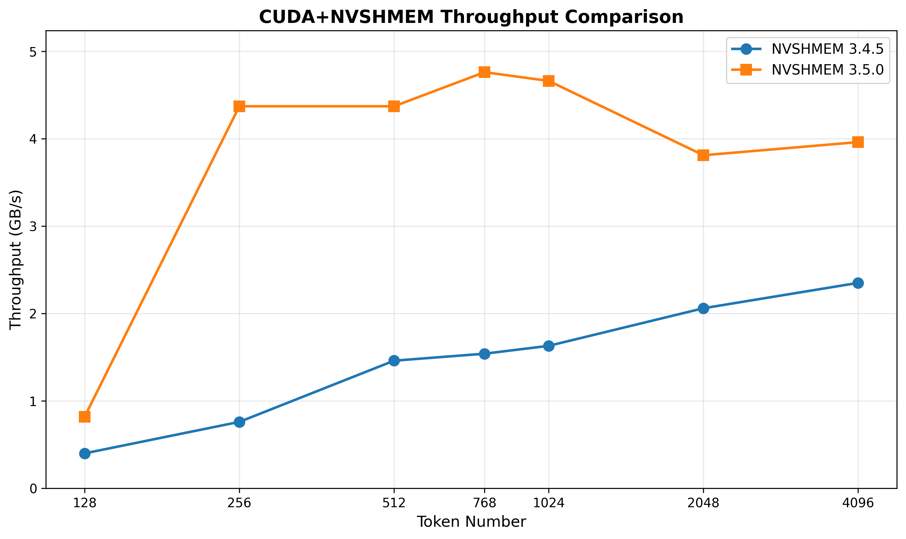

# MoE All-to-All Baseline Benchmarks

## Baselines

1. **PPLX Kernel**  
2. **PyTorch Distributed**  
3. **NVSHMEM**  


## Requirements
### 1. Build and install [pplx-kernels](https://github.com/perplexityai/pplx-kernels)

## Quick Start


### 1. Build CUDA Extension (Recommended)

```bash
cd /path/to/uccl/ep/bench/baseline
./build_pack_unpack.sh
```

### 2. Run single-node benchmark for PyTorch and nvshmem 

**Single node (all GPUs):**
```bash
python bench_nvshmem_sparse_uccl.py --dp-size 1
```

### 3. Run benchmark for PPLX Kernel

```bash
cd pplx-kernels
python3 -m tests.bench_all_to_all
```


## Multi-Node Setup

**Node 0 (Master):**
```bash
export MASTER_ADDR=<master_ip>
export MASTER_PORT=29500
export WORLD_SIZE=<total_gpus>
export WORLD_LOCAL_SIZE=<gpus_per_node>
export NODE_RANK=0
## Run NVSHMEM and PyTorch Distributed
python bench_nvshmem_sparse_uccl.py --dp-size 1
## Run PPLX Kernel
python3 -m tests.bench_all_to_all
```


**Node 1+ (Workers):**
```bash
export MASTER_ADDR=<master_ip>
export MASTER_PORT=29500
export WORLD_SIZE=<total_gpus>
export WORLD_LOCAL_SIZE=<gpus_per_node>
export NODE_RANK=<node_id>
## Run NVSHMEM and PyTorch Distributed
python bench_nvshmem_sparse_uccl.py --dp-size 1
## Run PPLX Kernel
python3 -m tests.bench_all_to_all
```

## Triton Backend

A vendor-agnostic Triton implementation of the MoE pack/unpack kernels is available as an alternative to the CUDA kernels. To use it, set:

```bash
export UCCL_PACK_UNPACK_BACKEND=triton
```

Valid values: `cuda` (default), `triton`, `cpu`

## Output

Results saved to: `uccl/ep/bench/data/<timestamp>_unified_moe_separated.tsv`

## NVSHMEM 3.4.5 vs 3.5.0


If using 3.5.0, you need to add the environment variable:

``` bash
NVSHMEM_BOOTSTRAP_TWO_STAGE=1
```


