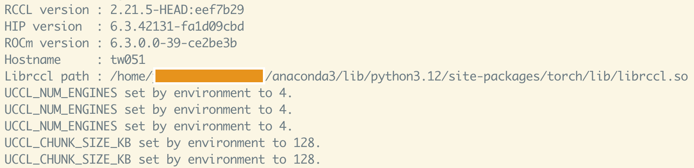

# UCCL PyTorch Examples

This folder contains examples demonstrating how to use **UCCL** (Ultra and Unified CCL) with PyTorch for distributed training on both **NVIDIA** and **AMD** GPU clusters.

---

## Overview

| Script | Description |
|--------|-------------|
| `ddp_train.py` | CIFAR-10 ResNet-18 training (NVIDIA/AMD unified) |
| `ddp_run.sh` | Launch script for DDP training |
| `multi_pg_test.py` | Multi-process-group stress test |
| `multi_pg_run.sh` | Launch script for stress test |

---

## Prerequisites

### For NVIDIA GPUs (CUDA)

```bash
pip3 install torch torchvision torchaudio --index-url https://download.pytorch.org/whl/cu121
```

### For AMD GPUs (ROCm)

```bash
pip3 install torch torchvision torchaudio --index-url https://download.pytorch.org/whl/rocm6.3
```

### Building and Installing UCCL

```bash
git clone https://github.com/uccl-project/uccl.git --recursive && cd uccl
bash build.sh [cuda|rocm] all --install
```

---

## Quick Start

### Single-Node Training

```bash
cd examples

# Auto-detect platform and use all GPUs
./ddp_run.sh

# Use specific number of GPUs
./ddp_run.sh 4
```

### Multi-Node Training

```bash
# Node 0 (master)
./ddp_run.sh 8 2 0 10.0.0.1

# Node 1 (worker)
./ddp_run.sh 8 2 1 10.0.0.1
```

### Arguments

```bash
./ddp_run.sh [NGPUS] [NNODES] [NODE_RANK] [MASTER_ADDR] [MASTER_PORT]
```

| Argument | Description | Default |
|----------|-------------|---------|
| `NGPUS` | GPUs per node | Auto-detect |
| `NNODES` | Number of nodes | 1 |
| `NODE_RANK` | This node's rank | 0 |
| `MASTER_ADDR` | Master node IP | localhost |
| `MASTER_PORT` | Master port | 12355 |

---

## Environment Setup

The `ddp_run.sh` script auto-detects your platform and sets the UCCL plugin:

```bash
# NVIDIA - automatically sets:
export NCCL_NET_PLUGIN=$(python3 -c "import uccl; print(uccl.nccl_plugin_path())")

# AMD - automatically sets:
export NCCL_NET_PLUGIN=$(python3 -c "import uccl; print(uccl.rccl_plugin_path())")
```

When UCCL is loaded, you'll see output like:
```
UCCL_* set by environment to xx
```

<p align="left">  </p>

---

## Multi-Process-Group Stress Test

This test creates four overlapping process groups and drives concurrent collectives:

```bash
./multi_pg_run.sh nccl single 4 100 4096   # BACKEND MODE GPUS ITER SIZE
```

---

## Troubleshooting

### General

- **Enable verbose logging**: `export NCCL_DEBUG=INFO GLOG_v=1`
- **Check GPU visibility**: `nvidia-smi` (CUDA) or `rocm-smi` (ROCm)

### NVIDIA-Specific

- **IB GID index issues**: Try `NCCL_IB_GID_INDEX=3`
- **Select specific NICs**: `NCCL_IB_HCA=mlx5_2:1`

### AMD-Specific

- **Import order**: Always `import torch` before `import uccl.p2p`

### Multi-Node

- **Gloo connection failures**: Set `GLOO_SOCKET_IFNAME=<interface>`
- **Firewall issues**: Ensure ports are open between nodes

---

## UCCL Environment Variables

| Variable | Description | Default |
|----------|-------------|---------|
| `UCCL_NUM_ENGINES` | Number of UCCL engines | 4 |
| `UCCL_PORT_ENTROPY` | Paths/QPs per engine | 8 |
| `UCCL_CHUNK_SIZE_KB` | Max chunk size per WQE | 128 |
| `UCCL_IB_HCA` | IB devices to use | auto |

---

## References

- [UCCL Project](https://github.com/uccl-project/uccl)
- [UCCL Collective RDMA README](../collective/rdma/README.md)
- [PyTorch Distributed](https://pytorch.org/docs/stable/distributed.html)
