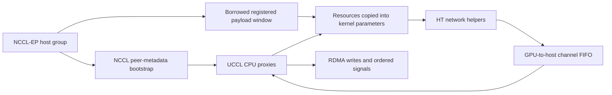
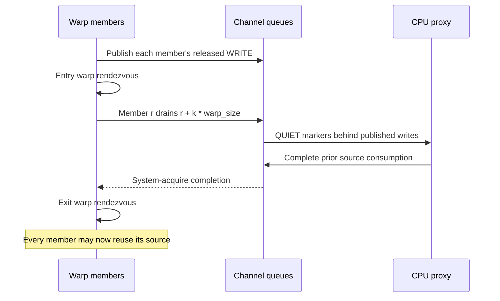

# GIN integration on official UCCL main

The base change supplies the standalone API and host ownership missing from the
transport extraction already in main. It reuses DanielDanyang's rail-primitives
increment at 29e7e7ca. The combined fix adds the licensed NCCL-EP snapshot, typed
signals and cooperative completion. Mainline device/NIC selection is retained;
`ep/`, `p2p/` and the shared GPU runtime stay on their mainline implementations.

The EP communicator exchanges metadata, so an EP subgroup need not equal
MPI_COMM_WORLD. Only equal-size, contiguous node rank layouts fit the current
rail mapping. Host setup checks the 13-bit signal byte-offset range. Single-node
HT uses the existing CUDA/NCCL intra-node path without creating UCCL proxies.
For distributed HT, the group owns the context, which borrows the existing GIN
window. Destruction stops/drains proxies and deregisters their memory before
`ncclMemFree` releases that window. Kernel parameters embed the resource bundle;
the handles it contains still point to device-resident queues.

Scalar flush remains available for a single caller. Cooperative Thread/Warp
flush covers every queue exactly once per group, including Q larger than 32 or
not divisible by 32. The adapter preserves acquire completion ordering. Typed
`ncclGin_SignalAdd` emits one ordered update per cooperating group, and indexed
64-bit reads/waits use system acquire ordering and rolling comparisons. CTA
cooperation is rejected at compilation.

[Validation and speed tables](tests/local/MAIN_FIX_RESULTS.md) distinguish native
GPU/host command fixtures, single-rank HT and full distributed/model execution.
The CPU CI builds the complete standalone host transport, NCCL-EP libraries for
both backends, and SM120/SM90 device objects; it executes no CUDA programs.
