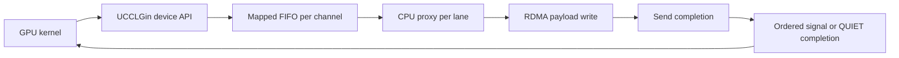
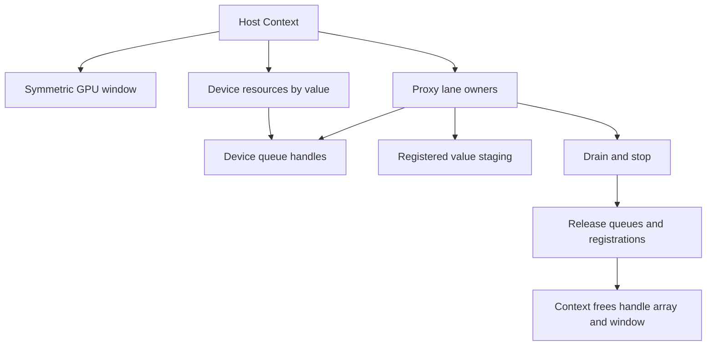

# Standalone UCCL-GIN

GPU-initiated rail operations publish commands to a mapped host FIFO. CPU proxies
translate them into RDMA writes and ordered counter updates. The public device
API exposes `put`, `put_tail_add`, `put_value`, `red_add_rel`, `quiet` and scalar
`flush`. LSA operations are not implemented by this standalone backend.

This integration reuses DanielDanyang's
[rail-primitives increment](https://github.com/DanielDanyang/uccl-danyang/tree/29e7e7ca868590fb3a70bc96ebf42271983ab9b6/experimental/uccl_gin).
It is applied to official UCCL main, preserving the mainline CUDA-device/NIC
selection and the shared CUDA, ROCm, Hygon and Cambricon runtime mappings.
The optional NCCL-EP adapter and cooperative/signal fixes are a separate change.



`Context` owns a symmetric payload window, the device array of queue handles and
its proxies. Proxies own registered per-command staging for `put_value`, so a
value remains valid until its write completes. `owns_gpu_buffer=false` keeps
proxy teardown from freeing the context's shared window. Queue hints retain the
proxy-major channel layout. Rail payloads above the 24-bit command length are
split into aligned chunks before publication; tail signals follow payload
completion.



## Build

Network execution requires CUDA, libnuma, ibverbs, libnl, MPI and an appropriate
RDMA device. EFA is the CUDA Makefile transport default. NCCL 2.30+ device headers
are needed for the NCCL reference microbench. Select the actual GPU architecture:

```sh
make -C experimental/uccl_gin CUDA_HOME=/usr/local/cuda SM=120 \
  PYTHON=/path/to/python NCCL_INC=/path/to/nccl/include \
  NCCL_LIB=/path/to/nccl/lib -j2
```

`PLATFORM=rocm GFX=gfx942` selects the HIP/RoCE build. Only put/quiet are supported
on that path; the CUDA EFA ordered-atomic protocol is not a RoCE atomic backend.
See [AMD support notes](AMD_SUPPORT_PLAN.md) for the reused implementation's scope.

For GPU/host command validation without an RDMA NIC, MPI or NCCL runtime:

```sh
make -C experimental/uccl_gin/tests/local SM=120 CUDA_HOME=/usr/local/cuda -j2
experimental/uccl_gin/tests/local/build/sm120/capabilities --device 0
experimental/uccl_gin/tests/local/build/sm120/queue_smoke --device 0 \
  --producers 1024 --capacity 4096 --commands 100000 --rounds 3
```

The fixture uses the production FIFO, encodes and checks every command field,
checks duplicate/missing commands, wraps and reuses the queue, and requires one
scalar QUIET per round. Its consumer supplies completions. These checks do not
qualify network receiver visibility or model E2E.

See [local test instructions](tests/local/README.md),
[architecture](ARCHITECTURE.md) and [source guide](CODE_GUIDE.md).
